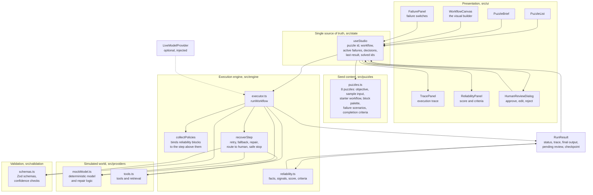
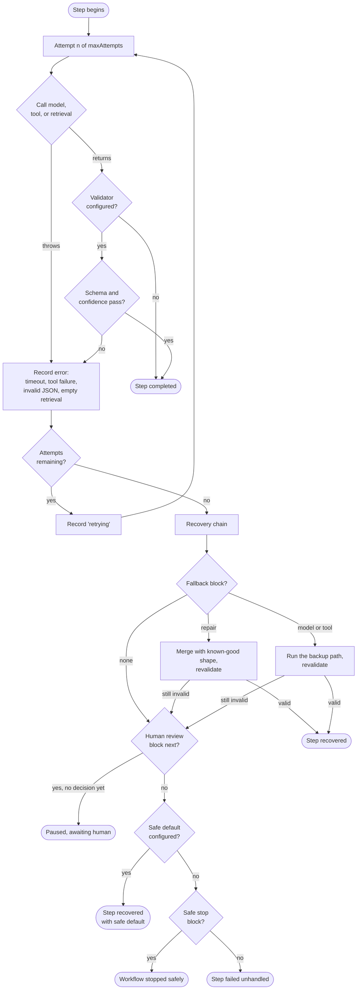
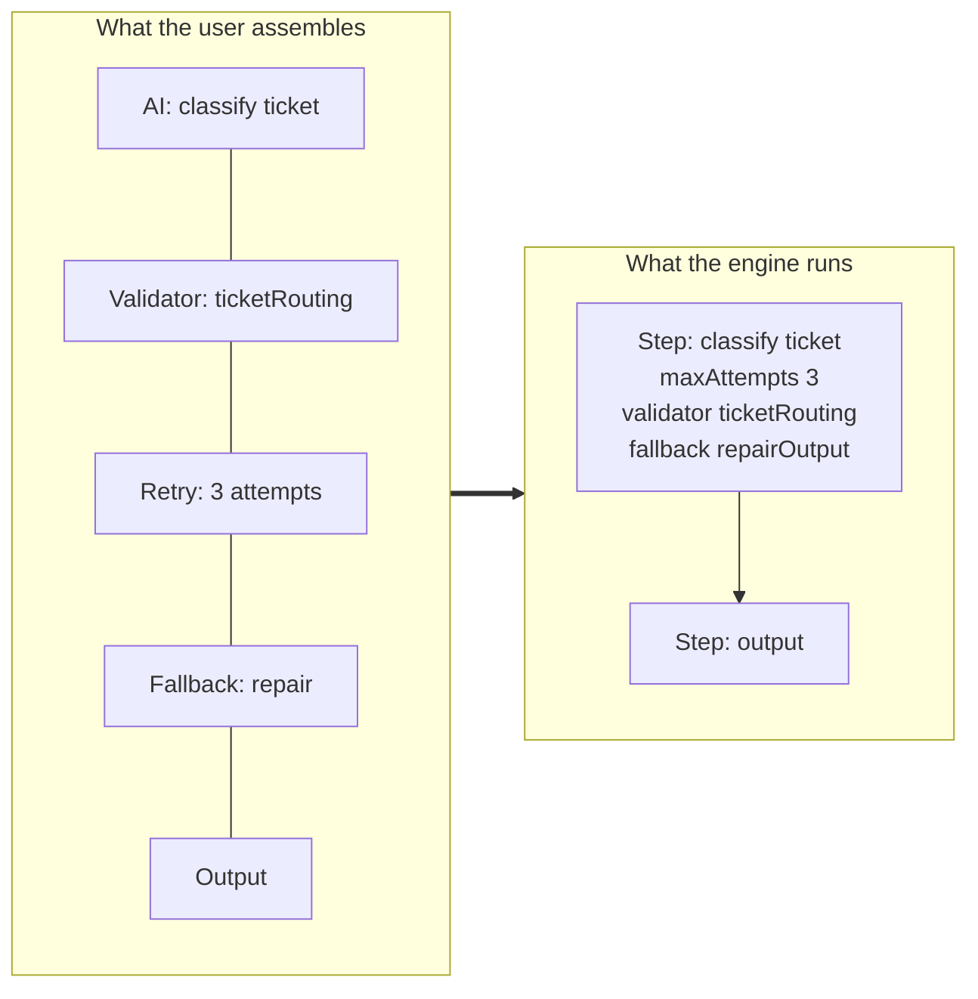
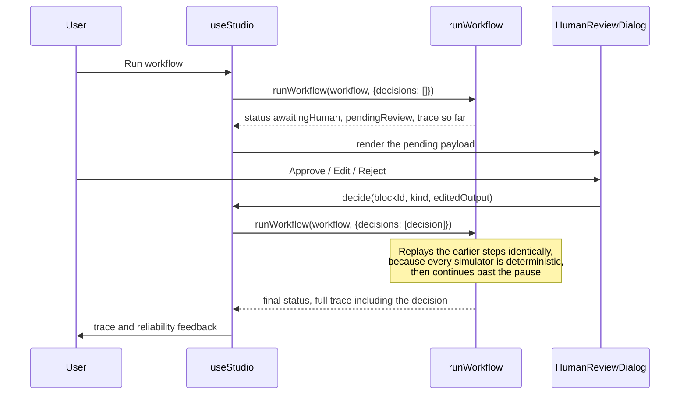

# Architecture

This document covers the deliverable "Architecture Diagram" and explains how the pieces fit,
what depends on what, and why the boundaries are where they are.

---

## 1. System overview

The arrows that matter: **the engine never points back at the UI.** `runWorkflow` takes a workflow
and a run context and returns a result. The UI reads that result. Nothing in `src/engine`,
`src/providers`, `src/validation`, or `src/puzzles` imports React.

---

## 2. What one step actually does

Every executable step runs through the same path. This is the core of the failure handling.

Each box that ends the flow writes one trace entry, which is what the Execution trace panel renders
and what the reliability scoring reads afterwards. There is no separate log: **the trace is the
only record, and both the UI and the scoring read the same one.**

---

## 3. How blocks bind to each other

A workflow is a flat list, but reliability blocks are not steps in their own right. They configure
the executable step above them.

`collectPolicies` walks forward from an executable block, absorbing every `retry`, `validator`,
`fallback`, and `safeStop` it meets, and stops at the next executable block. A `humanReview` block
is noted as a recovery route but is **not** absorbed: it stays in the sequence so it also pauses the
workflow on a successful path. That is the difference between "ask a human when something breaks"
and "always ask a human before sending", and puzzle 5 depends on the second one.

---

## 4. Human review without a suspended process

The engine is a pure function, so there is no coroutine to park. Pausing works like this:

The replay is only sound because the model, the tools, and the retrieval are deterministic
functions of `(task, attempt, active failures)`. That property is worth more than it looks: it is
also what makes a reviewer able to reproduce any screenshot, and what makes the trace comparison in
the test suite possible.

Resuming from a checkpoint uses the same mechanism, with the earlier trace passed back in as
`completedBeforeResume` plus a synthetic entry recording the resume itself, so the interrupted run
stays visible in the history instead of being quietly erased.

---

## 5. Data that crosses each boundary

| Boundary | What crosses it | Direction |
| --- | --- | --- |
| UI to state | user intent: select puzzle, add/move/remove block, edit config, toggle failure, run, decide | one way |
| State to engine | `Workflow` plus `RunContext` (input, active failures, human decisions, optional live provider, resume point) | one way |
| Engine to providers | `ModelRequest` and tool calls carrying task, attempt, and active failures | one way |
| Providers to engine | parsed payload, confidence, provider name, or a typed error | one way |
| Engine to validation | the step output and the validator config | one way |
| Engine to state | `RunResult`: status, trace, final output, pending review, checkpoint, reliability report | one way |
| State to UI | derived view data only, no setters into the engine | one way |

There is no shared mutable object between the UI and the engine, and no path where the UI reaches
into an intermediate engine state. Everything the UI knows about a run arrives in the `RunResult`.

---

## 6. Why these boundaries

**The engine is testable without a browser.** All 23 tests are synchronous calls into
`runWorkflow` and `evaluateCriteria`. They assert on real behaviour: that each puzzle is unsolved
at the start, that each is solvable with its own palette, that two identical runs produce byte
identical traces, and that a handled failure scores above an unhandled one.

**The seed content is data, not code paths.** Adding a ninth puzzle means adding an object to
`puzzles.ts`. No engine change, no UI change, no new component.

**The simulated world is swappable.** `LiveModelProvider` is the only seam a real provider needs.
The engine awaits it exactly where it would await a mock, so retries, validation, fallbacks, and the
trace behave identically whether the answer came from a simulator or a network call.

**Scoring reads the trace, not the workflow.** Completion criteria are evaluated from what actually
happened during execution. That is why most puzzles have more than one valid solution, and why a
solution that only looks right on the canvas does not pass.
