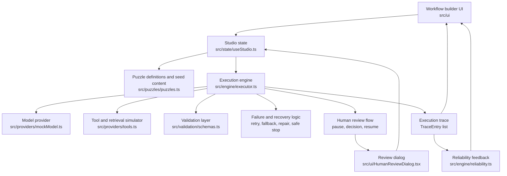

# AI Workflow Puzzle Builder

A browser-based puzzle lab for learning how resilient AI workflows are designed.

You pick a puzzle, assemble a multi-step workflow out of blocks, run it against a committed
sample input, watch it break in a controlled way, and then repair it with retries, fallbacks,
validators, safe stops, and human review. After every run the app tells you what the run
actually proves about your design, and what it does not.

Nothing here calls a paid service. The model and the tools are deterministic simulators, so the
same switches always produce the same trace, which means a reviewer can reproduce every result.

---

## Run it locally

Requires Node 20 or newer.

```bash
npm install
npm run build
npm run preview
```

`npm run preview` serves the production build and prints a local URL. Open it in any browser.

For development with hot reload:

```bash
npm run dev
```

To run the engine test suite:

```bash
npm test
```

23 tests cover the execution engine, every recovery strategy, the reliability scoring, and the
determinism guarantee. They also prove that every shipped puzzle starts unsolved and can be solved
with the blocks in its palette, so no puzzle is a dead end and none is already done for you.

---

## How the workflow builder works

A workflow is an ordered list of blocks. Blocks fall into three groups.

**Core blocks** do the work.

| Block | What it does |
| --- | --- |
| Input | Hands the committed sample input to the workflow |
| AI model / prompt | Calls the model provider for one task, for example summarise or classify |
| Tool / API | Calls a simulated tool such as a CRM lookup or a mailer |
| Retrieval | Searches the seeded document set for supporting evidence |
| Condition | Checks a field on the carried value |
| Transform | Reshapes the carried value, for example attaching evidence ids |
| Output | Marks the end of the workflow |

**Reliability blocks** change how the step above them behaves.

| Block | What it does |
| --- | --- |
| Validator | Checks the previous result against a schema, and optionally a confidence threshold |
| Retry | Repeats the step above it up to the configured number of attempts |
| Fallback | Runs a backup path once the attempts are used up: repair the output, switch model, switch tool, or use a safe default |
| Safe stop | Ends the workflow on purpose instead of passing an untrusted result downstream |

**Human control** interrupts execution.

| Block | What it does |
| --- | --- |
| Human review | Pauses the workflow, shows the current result, and waits for approve, edit, or reject |

The rule that makes the builder readable: **a reliability block acts on the executable step
directly above it.** So `AI → Validator → Retry → Fallback` means "call the model, check the
shape, retry if the check fails, and if the attempts run out, repair the result".

Order matters, and getting the order wrong is part of several puzzles. A `Safe stop` placed after
the wrong step will not catch the failure you meant to catch.

### Editing a workflow

- Click a block in **Available blocks** to insert it before the output step
- Drag a block, or use the arrow buttons, to move it
- Click `×` to remove a block you added, core blocks are fixed
- `Reset to starter` puts the puzzle back to its shipped starting point

---

## The puzzles

Eight puzzles ship with the app, across three difficulty levels. Each one carries its objective,
its sample input, its expected output, its failure scenario, and its completion criteria.

| # | Puzzle | Level | The lesson |
| --- | --- | --- | --- |
| 1 | Fix the Meeting Summarizer | beginner | A model that fails the same way every time cannot be retried into working. Validate, then repair. |
| 2 | Ground the Knowledge Assistant | beginner | When there is no evidence, refusing to answer is the correct outcome, not a crash. |
| 3 | Repair the Ticket Router | intermediate | Impossible values must never reach a queue. Validation plus repair beats hope. |
| 4 | Survive the Research Timeout | intermediate | A transient timeout is what retries are for. A second source is faster still. |
| 5 | Approve Before Sending | intermediate | Money, customers, and low confidence mean a person decides, and the decision is recorded. |
| 6 | Activate the Fallback | advanced | Two different failures stacked together need two different strategies. |
| 7 | Catch the Half-Written Answer | beginner | A truncated reply has no field to validate. Throw it away and ask again. |
| 8 | Resume the Interrupted Mission | advanced | When a long run breaks, continue from the last successful step instead of paying for the work twice. |

Every puzzle except 5 requires handling or recovering from a failure. Puzzles 1, 3, and 6 require
structured-output validation. Puzzle 5 pauses and records a human decision before continuing.
Puzzle 8 is the only one solved by resuming rather than by adding a block.

A puzzle is solved when every completion criterion in the right-hand panel is met. Criteria are
evaluated from the actual execution trace, not from the shape of the workflow, so there is more
than one valid solution to most puzzles.

---

## Failure simulation

Every failure is deterministic and repeatable. Switch one on in **Failure scenarios** and run
again, and you get the identical trace every time.

| Failure | Behaviour |
| --- | --- |
| `modelTimeout` | The model does not answer on attempts 1 and 2, then recovers |
| `toolTimeout` | The tool does not answer on attempts 1 and 2, then recovers |
| `toolFailure` | The tool returns 503 on attempt 1, then recovers |
| `invalidJson` | The model returns truncated text that is not valid JSON on attempt 1 |
| `missingField` | The model omits a required field on every attempt |
| `schemaValidation` | The model returns values outside the allowed range on every attempt |
| `emptyRetrieval` | Retrieval returns zero documents |
| `lowConfidence` | The model answers with a confidence of 0.24 |

Two of these never fix themselves. `missingField` and `schemaValidation` fail identically on
every attempt, which is the point: retrying a confidently wrong model just wastes attempts. Those
need a validator to notice and a fallback to repair.

The transient ones (`modelTimeout`, `toolTimeout`, `toolFailure`) do clear up, so retries are the
right answer, and the trace shows exactly how many attempts it cost.

---

## Recovery strategies

When a step fails or its result does not validate, the engine works through the recovery options
that are configured for that step, in this order:

1. **Retry** while attempts remain, recording each attempt in the trace
2. **Fallback**, once attempts are exhausted, using one of four strategies:
   - `repairOutput` merges the broken result with a known-good shape and revalidates it
   - `fallbackModel` re-runs the step against the backup provider
   - `fallbackTool` switches to the backup tool
   - `safeDefault` substitutes a configured default value
3. **Human review**, if a review block follows the step, pausing for a person to decide
4. **Safe stop**, ending the workflow deliberately with a clear reason
5. If none of these are configured, the step **fails unhandled**, and the reliability panel says so

A repair is not a cover-up: the repaired result is validated again, and if it still does not pass,
the recovery is marked as failed in the trace.

---

## Validation and human review

Validation uses [Zod](https://zod.dev) schemas, one per output type: `meetingSummary`,
`groundedAnswer`, `ticketRouting`, `outboundMessage`, `invoiceRecord`, `researchDigest`.

A validator checks required fields, data types, allowed values, and output format. It can also
enforce a **minimum confidence**: set `Min confidence` on the validator block, and a result whose
confidence falls below it is rejected even when its shape is perfect. That is how puzzle 5 turns
an unsure model into a human decision.

A human reviewer can:

- **Approve**, and the result continues unchanged
- **Save edit and continue**, and the edited JSON becomes the result the workflow carries forward
- **Reject and stop**, and the workflow stops safely with the rejection recorded

Every decision, including the reason typed into the box, lands in the execution trace. A rejection
is a valid solution to puzzle 5: refusing to send is a correct outcome, and the app scores it as one.

---

## Execution trace and reliability feedback

The trace lists every step in order with its status: `completed`, `failed`, `retrying`,
`recovered`, `paused`, or `safe stop`. Expand any entry to see its input, its output, the
validation result with the exact failing field paths, the error, and the recovery action that was
taken. Failed and paused steps are expanded by default.

After the run, the reliability panel gives a score out of 100 and a grade:

- **resilient**, 70 or above, the design survives what you threw at it
- **fragile**, below 70, something is still unguarded
- **unfinished**, the workflow is paused waiting for a person

The score rewards finishing or stopping safely, validating the output, handling an injected
failure, successful retries and fallbacks, and recorded human decisions. **Still unresolved**
lists what is not covered yet, which is usually the fastest way to see the next move.

Note that a clean run with no failure injected scores lower than a run that survives a failure.
That is deliberate: a workflow that has never been tested against a failure has not proved anything.

---

## Mock AI mode

The app runs in mock mode by default, and the header says so. The mock provider is a deterministic
function of the task, the attempt number, and the active failure switches. It returns realistic
structured payloads and realistic broken ones, and it never touches the network.

This is what makes every puzzle reproducible for a reviewer, and it is why nothing in this project
requires paid AI access.

### Wiring in a real provider

The engine talks to models through one interface, in `src/domain/types.ts`:

```ts
export interface LiveModelProvider {
  name: string
  complete(request: ModelRequest): Promise<ModelResponse>
}
```

To use a live model, implement that interface and pass it as `liveProvider` on the `RunContext`
handed to `runWorkflow`. A `ModelResponse` needs a `raw` string, a `parsed` value, a `confidence`
number, a `provider` name, and `usedMock: false`. Everything downstream, including validation,
retries, fallbacks, and the trace, works identically, and steps that used a live provider stop
showing the `mock` tag in the trace.

No API key is read from the environment anywhere in this repository.

---

## Architecture



### Source layout

```
src/
  domain/types.ts            every shared type, no logic
  engine/
    executor.ts              the workflow engine, framework free
    reliability.ts           scoring, signals, and criteria evaluation
    executor.test.ts         engine and scoring tests
  providers/
    mockModel.ts             deterministic model simulator and repair logic
    tools.ts                 tool and retrieval simulators
  validation/schemas.ts      Zod schemas and validation helpers
  puzzles/puzzles.ts         all seed content: puzzles, inputs, palettes, criteria
  state/useStudio.ts         the single source of truth for the UI
  ui/                        presentation only
```

### Design decisions

**The engine does not import React.** `runWorkflow` is a pure function from a workflow plus a run
context to a result. That is why the tests are synchronous and fast, and why the engine would
survive a change of view layer.

**One source of truth.** The studio state holds the puzzle id, the workflow, the active failures,
and the human decisions. Everything else, including whether a puzzle is solved, is derived. There
is no second copy of the run to drift out of sync.

**Human review is a re-run, not a suspended coroutine.** When a decision arrives, the engine runs
the whole workflow again with that decision in the context. Because every simulator is
deterministic, the replay reproduces the earlier steps exactly and then continues past the pause.
This keeps the engine a pure function and makes the paused state trivially serialisable.

---

## Assumptions

- Workflows are linear. Branching is expressed with condition blocks and recovery strategies rather
  than a general graph, which keeps the builder readable and matches the learning goal.
- Reliability blocks bind to the executable step directly above them, which is the smallest rule
  that supports retry, validate, fallback, and safe stop without a separate wiring UI.
- Durations in the trace are fixed per block type. Wall-clock timing would make traces
  irreproducible, and reproducibility matters more here than realism.
- Puzzle progress lives in memory for the session. There is no backend and nothing is persisted.

## Known limitations

- No branching graph editor: a workflow is a sequence, not a DAG
- No persistence: reloading the page resets progress and the assembled workflows
- The live provider interface exists and is honoured by the engine, but no concrete live adapter
  ships in this repository, because a reviewer must be able to run everything without an API key
- Retrieval searches a small seeded document set with word matching, not embeddings
- The reliability score is a teaching heuristic, not a formal reliability model

## Licence

MIT
